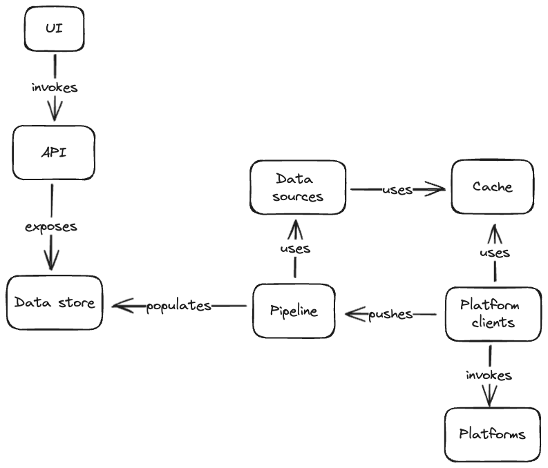
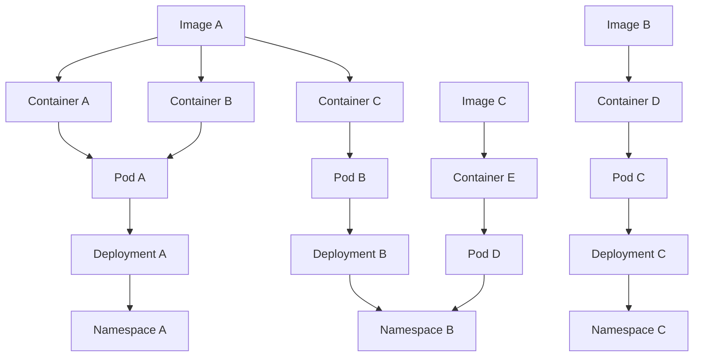
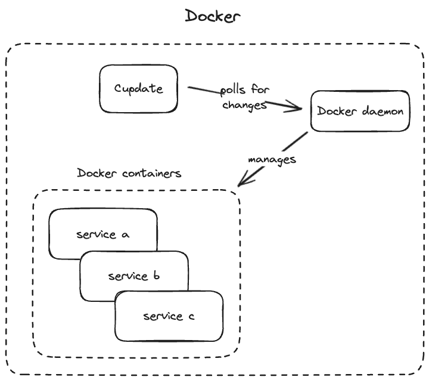

# Architecture

> [!WARNING]
> WIP

Cupdate discovers container images that are in use in a _platform_. Next,
Cupdate discovers new versions for these container images in their respective
OCI registry. Lastly data is enriched from sources like Docker Hub and GitHub,
depending on the information gathered about the image from the registry.

## Cupdate

## Platforms

Platforms are responsible for identifying all images in use, as well as how they
are used, by building a graph. Below is an example graph collected from
Kubernetes. In practice, the node for the platform itself is implicit and not
definied in code.

### Kubernetes

When running in Kubernetes, Cupdate lists and then watches all resources that
references an image. Resources such as pods directly refences an image that is
in use. Resources like deployments reference images through pod templates.

### Docker

When using Docker, Cupdate uses `docker.sock` directly to identify images and
containers using those images.

## Workflow

Once images have been identified in platforms, a few steps are taken to
consolidate what images are available and how they're used.

This processing is done using a workflow implementation deeply inspired by
GitHub Actions. The implementation allows expressive declaration of workflows
with reusable and loosely coupled components.

The code for the workflow implementation is kept in
[internal/workflow](internal/workflow).

## Data

Data is persisted using SQLite. The code for the state store is kept in
[internal/store](internal/store).
