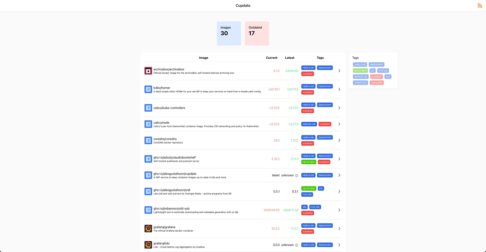
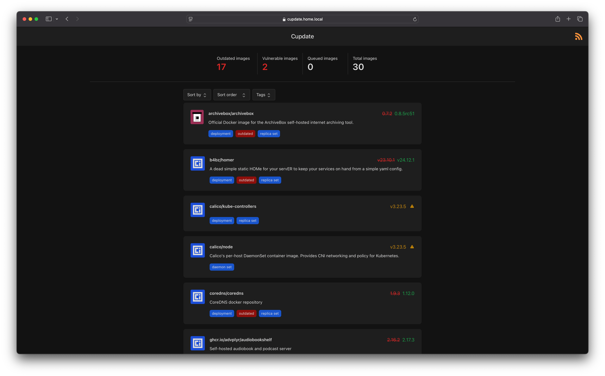
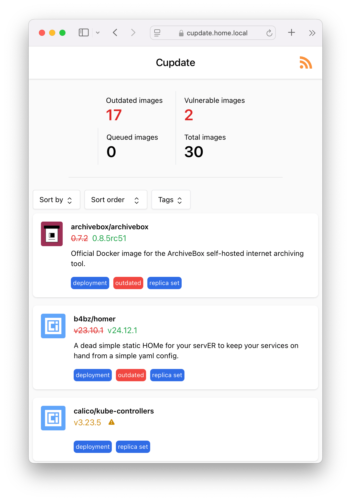
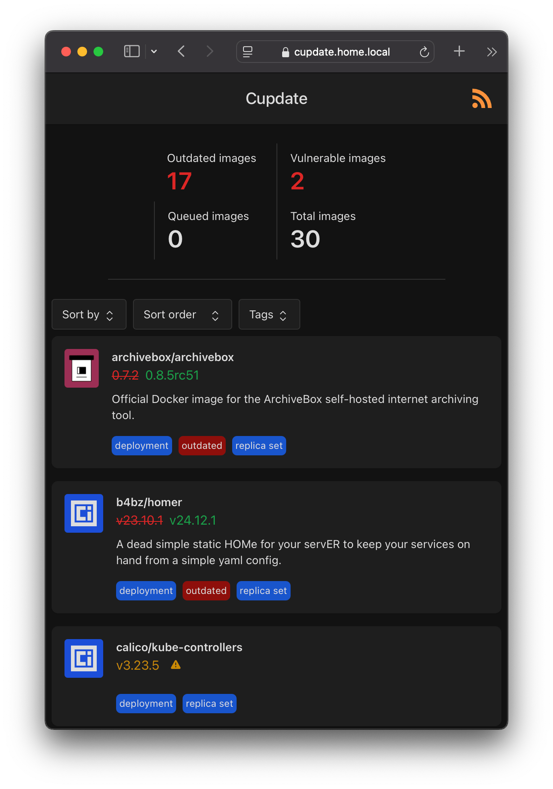
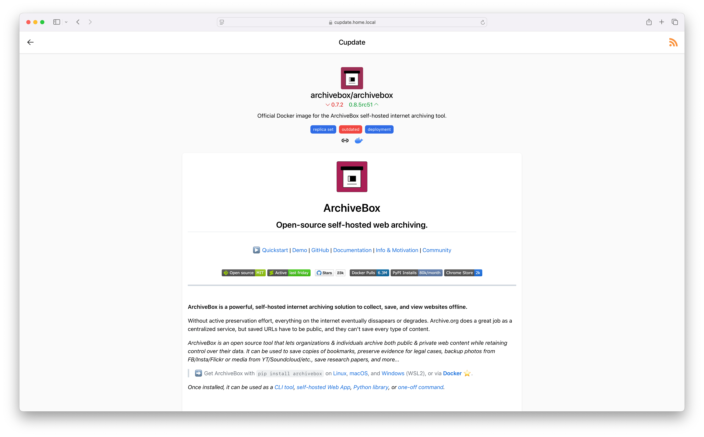
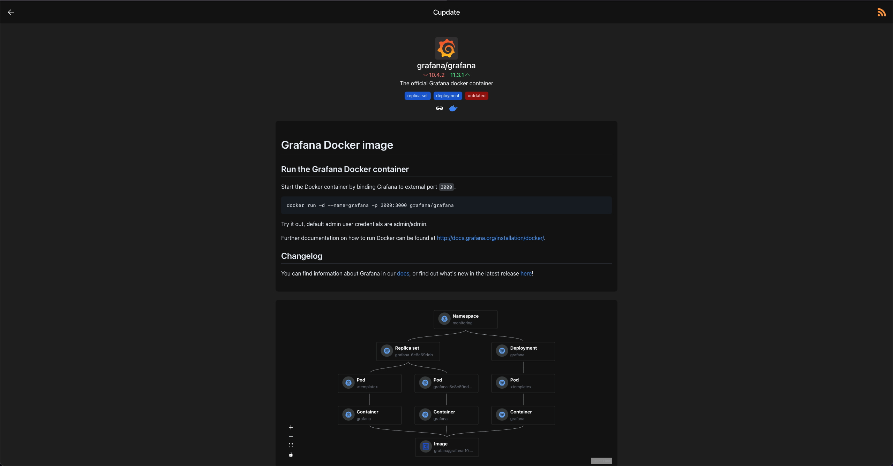
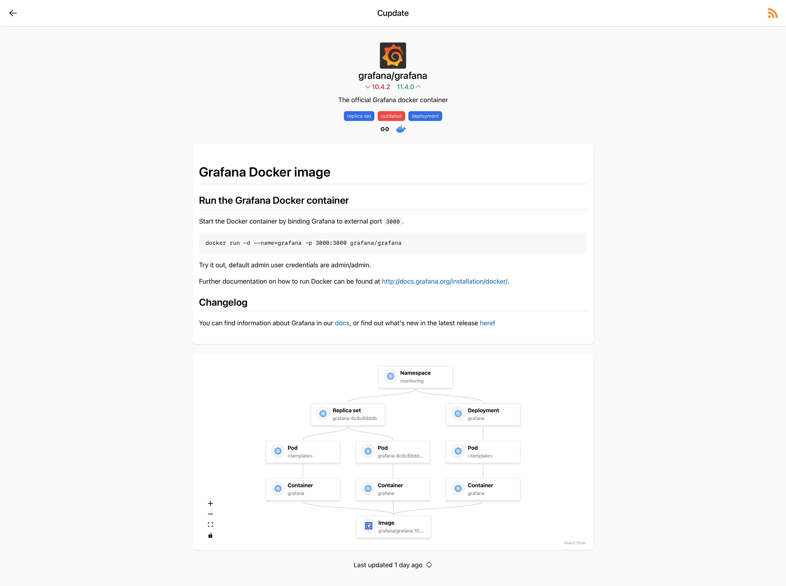
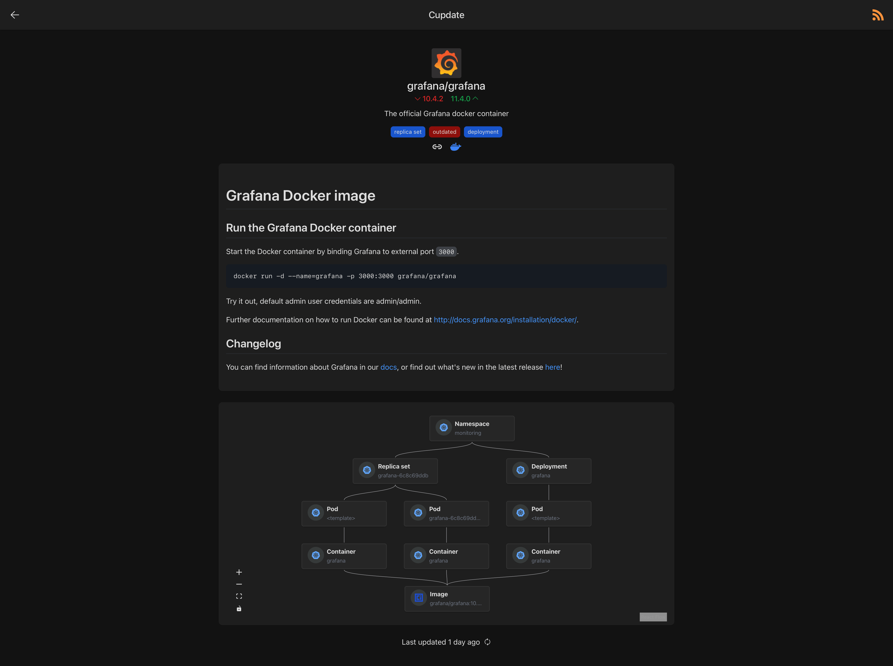
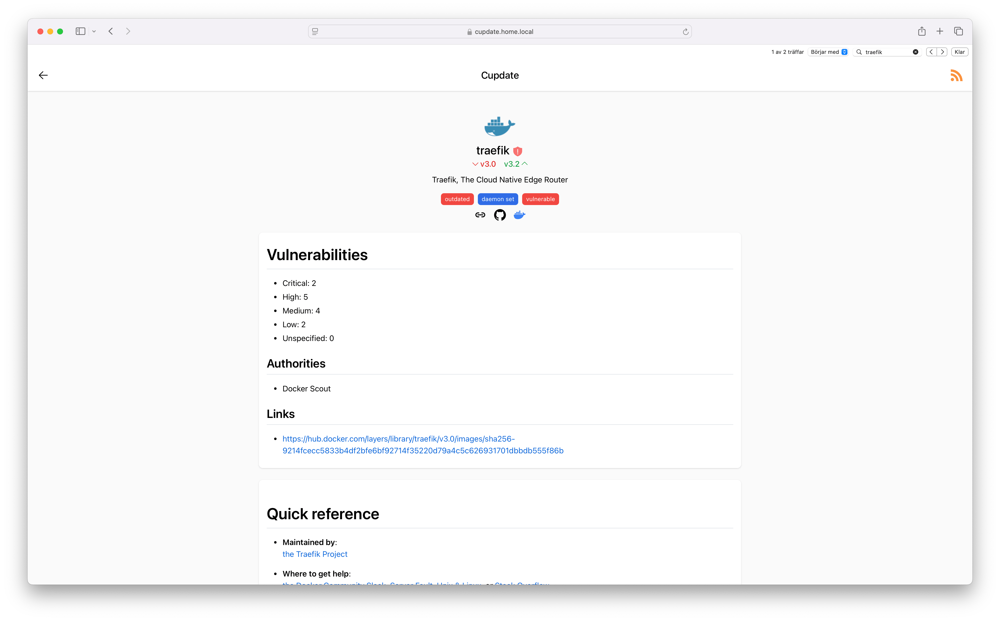
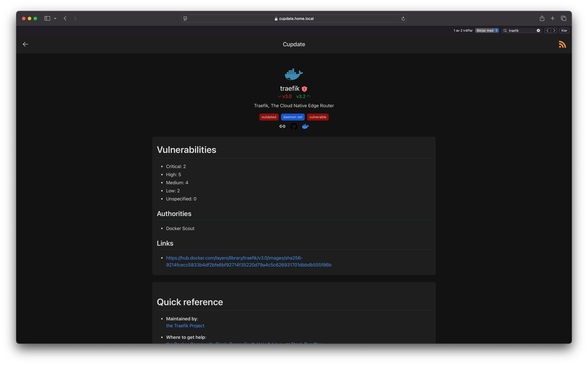

<p align="center">
  
</p>

# Cupdate

Cupdate is a zero-config service that helps you keep your container images
up-to-date. It automatically identifies container images in use in your
Kubernetes cluster or on your Docker host. Cupdate then identifies the latest
available version and makes this data and more available to you via a UI, API or
through an RSS feed.

Cupdate is for those who like the process of keeping their services up-to-date,
looking through what's outdated and what features new updates bring. Cupdate
will not help you deploy the updates. If you deploy your services using things
like [flux](https://github.com/fluxcd/flux2), then there are great services that
will modify your manifests for you, such as Dependabot or
[Renovate](https://github.com/renovatebot/renovate). Cupdate is not about that,
nor will it ever be. That's not to say that Cupdate won't integrate well with
such services. Cupdate can still act as a dashboard of your deployed services,
visualizing their graphs and versions.

Features:

- Zero configuration required
- Performant and lightweight - uses virtually zero CPU and roughly 14MiB RAM
- Auto-detect container images in Kubernetes and Docker
- Auto-detect the latest available container image versions
- UI for discovering updates
- Subscribe to updates via an RSS feed
- Graphs image versions' dependants explaining why they're in use
- Vulnerability scanning via Docker Scout, Quay and the
  GitHub Advisory Database through [vulndb](https://github.com/AlexGustafsson/cupdate/pkgs/container/cupdate%2Fvulndb).
- APIs for custom integrations

Supported registries:

- docker.io
- ghcr.io
- quay.io
- lscr.io
- registry.k8s.io, k8s.gcr.io
- registry.gitlab.com

Supported data sources:

- Docker Hub, Docker Scout
- GitHub, GitHub Container Registry
- GitLab
- Quay

## Running

Cupdate can be deployed using Kubernetes or Docker. It's designed to run well
with minimal required configuration. Please refer to the platform-specific
documentation for more information on how to deploy:

- Kubernetes: [docs/kubernetes/README.md](docs/kubernetes/README.md)
- Docker: [docs/docker/README.md](docs/docker/README.md)

Cupdate requires zero configuration, but is very configurable. See
[docs/config.md](docs/config.md) for more information.

## Screenshots

| Light mode                                                                                            | Dark mode                                                                                           |
| ----------------------------------------------------------------------------------------------------- | --------------------------------------------------------------------------------------------------- |
|                          |                          |
|    |    |
|                        |                        |
|              |              |
|  |  |

## Architecture

See [docs/architecture/architecture.md](docs/architecture/architecture.md).

## Building

Either build using yarn+go, or docker.

```shell
yarn install
yarn build
go build -o cupdate cmd/cupdate/*.go
```

```shell
# Build for running the container
docker build -t ghcr.com/alexgustafsson/cupdate:latest .

# Build inside the container, for running on host
DOCKER_BUILDKIT=1 docker build --target=export . --output .
```

## Contributing

Cupdate is still being developed.

### Development

Proxy the Kubernetes API server.

```shell
kubectl proxy
```

Link the Docker socket.

```shell
ln -s ~/.colima/default/docker.sock docker.sock
```

Source the default dev config for the target platform.

```shell
# Inspect
cat .env-kubernetes

# Bash etc.
source .env-kubernetes

# Fish
export (cat .env-kubernetes | xargs -L 1)
```

Start cupdate.

```shell
go run cmd/cupdate/*.go
```

Start the web server.

```shell
yarn run dev
```

Using Jaeger for otel testing.

```shell
docker run --rm -it \
  -p 4317:4317 \
  -p 8081:16686 \
  jaegertracing/all-in-one

export CUPDATE_OTEL_TARGET=localhost:4317
export CUPDATE_OTEL_INSECURE=true
```
