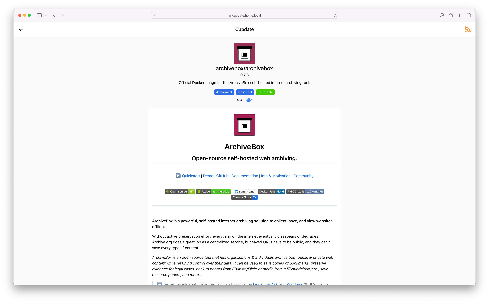

  

# Cupdate

[Live demo](https://alexgustafsson.github.io/cupdate).

Cupdate is a zero-config service that helps you keep your container images
up-to-date. It automatically identifies container images in use in your
Kubernetes cluster or on your Docker host. Cupdate then identifies the latest
available version and makes this data and more available to you via a UI, API or
through an RSS feed.

Cupdate is for those who like the process of keeping their services up-to-date,
looking through what's outdated and what features new updates bring. Cupdate
will not help you deploy the updates. If you deploy your services using things
like [flux](https://github.com/fluxcd/flux2), then there are great services that
will modify your manifests for you, such as Dependabot or
[Renovate](https://github.com/renovatebot/renovate). Cupdate is not about that,
nor will it ever be. That's not to say that Cupdate won't integrate well with
such services. Cupdate can still act as a dashboard for your deployed services,
visualizing images in use, versions and vulnerabilities. Cupdate's APIs can also
be used to write such services/scripts with ease. There are example scripts for
Kubernetes and Docker in the [cookbook](docs/cookbook/README.md).

Features:

- Performant and lightweight - uses virtually zero CPU and very little RAM
- Auto-detect container images in use by Kubernetes or Docker (one or more
  hosts, local or remote)
- Auto-detect the latest available container image versions
- Vulnerability scanning
  - Official and participating [Docker Hub](https://hub.docker.com) images
    through [Docker Scout](https://docs.docker.com/scout/)
  - Participating [Quay](https://www.projectquay.io) images through
    [Clair](https://github.com/quay/clair)
  - Images correlated to GitHub repositories with GitHub Advisories via
    [vulndb](#vulndb)
  - Images with SBOMs via [osv.dev](https://osv.dev)
- Graphs image versions' dependants explaining why they're in use
- UI for discovering updates, release notes and more
- Subscribe to updates via an RSS feed
- APIs for custom integrations

Supported registries:

- docker.io
- ghcr.io
- quay.io
- lscr.io
- registry.k8s.io
- k8s.gcr.io, gke.gcr.io, gcr.io
- registry.gitlab.com
- ... other OCI-compliant registries (Zot, Harbor, Gitea)

Supported data sources:

- Docker Hub, Docker Scout
- GitHub, GitHub Container Registry, GitHub Advisory Database
- GitLab
- Quay
- OpenSSF Scorecard reports
- OSV

## Getting started

Cupdate can be deployed using Kubernetes or Docker. It's designed to run well
with zero or very little configuration. Refer to the platform-specific
documentation for more information on how to get started with Cupdate:

- Running Cupdate using Kubernetes:
  [docs/kubernetes/README.md](docs/kubernetes/README.md)
- Running Cupdate using Docker:
  [docs/docker/README.md](docs/docker/README.md)

Cupdate can expose metrics and traces. For more information on how to use them,
see [docs/observability/README.md](docs/observability/README.md).

If you want to deploy Cupdate as a container through other means, chose the
latest [released version](https://github.com/AlexGustafsson/cupdate/releases)
and refer to the general config documentation in
[docs/config.md](docs/config.md). The `latest` tag tracks the main branch and is
therefore **not recommended** to use unless you want to try out the latest,
potentially unstable features.

Although not recommended or intended, Cupdate can be run directly on host. In
that case, please build Cupdate and run it using the instructions in
[CONTRIBUTING.md](CONTRIBUTING.md).

## Screenshots

To experience an always up-to-date version of Cupdate's UI, visit the
[live demo](https://alexgustafsson.github.io/cupdate).

| Light mode                                                                                            | Dark mode                                                                                           |
| ----------------------------------------------------------------------------------------------------- | --------------------------------------------------------------------------------------------------- |
|                          |                          |
|    |    |
|                        |                        |
|   |        |
|       |            |
|  |  |

## Vulndb

Vulndb is a tiny sqlite file that contains information useful to statically look
up known vulnerabilities in container images based on their source repositories.
For now it uses GitHub's advisory database.

For more information see [tools/vulndb/README.md](tools/vulndb/README.md).

The database is updated daily and published as an OCI artifact used by Cupdate.
The artifact is available here:
<https://github.com/AlexGustafsson/cupdate/pkgs/container/cupdate%2Fvulndb>.
