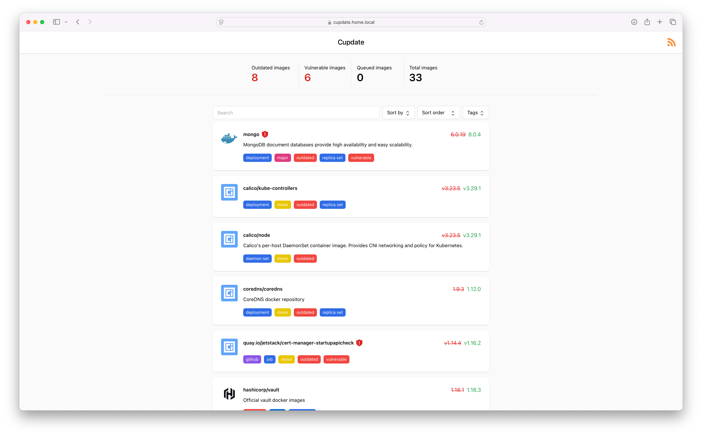
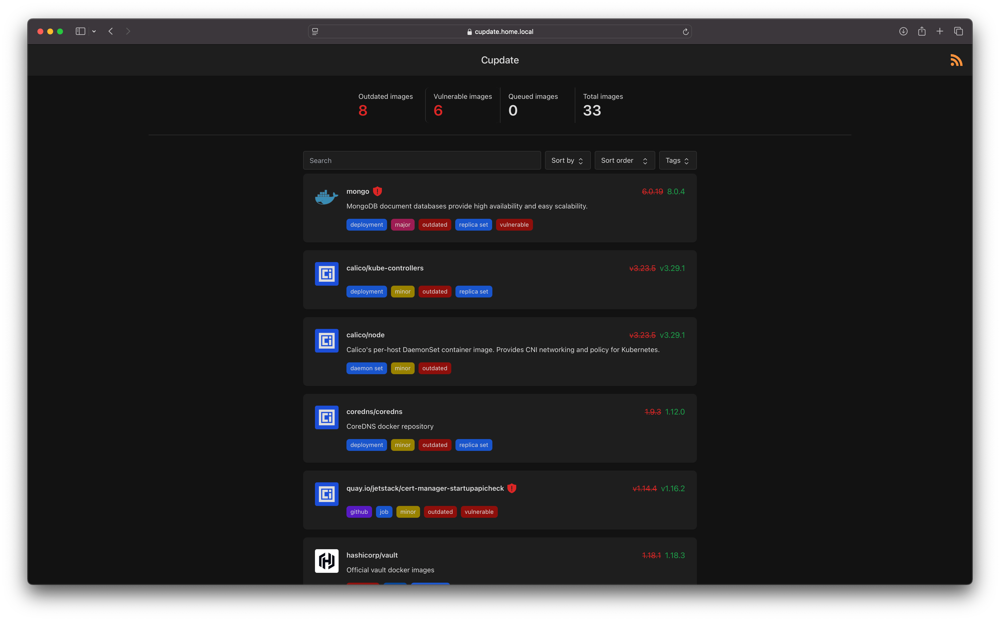
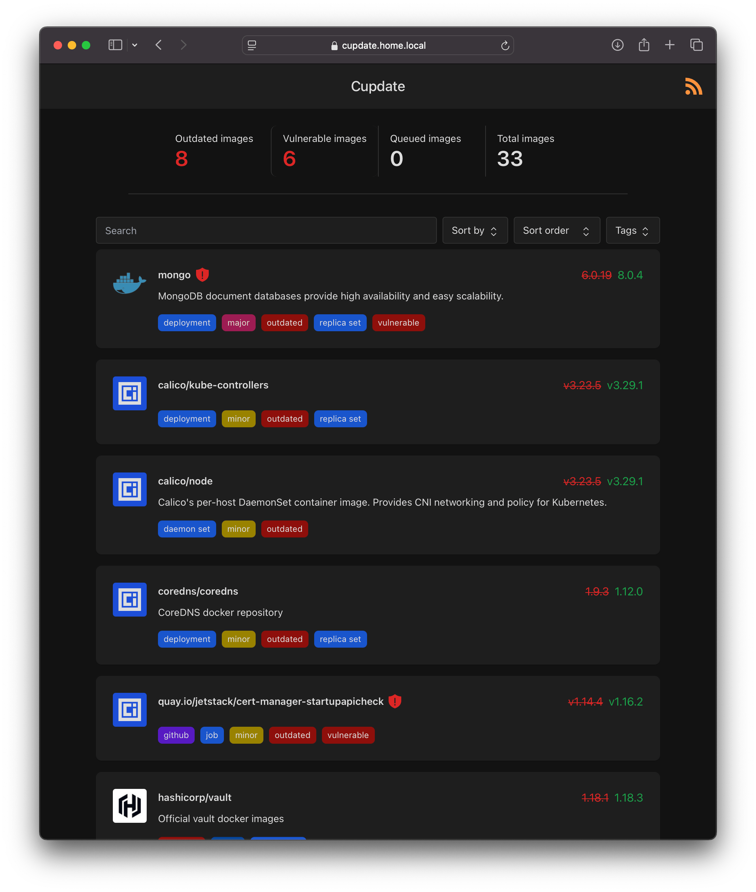

  

# Cupdate

Cupdate is a zero-config service that helps you keep your container images
up-to-date. It automatically identifies container images in use in your
Kubernetes cluster or on your Docker host. Cupdate then identifies the latest
available version and makes this data and more available to you via a UI, API or
through an RSS feed.

Cupdate is for those who like the process of keeping their services up-to-date,
looking through what's outdated and what features new updates bring. Cupdate
will not help you deploy the updates. If you deploy your services using things
like [flux](https://github.com/fluxcd/flux2), then there are great services that
will modify your manifests for you, such as Dependabot or
[Renovate](https://github.com/renovatebot/renovate). Cupdate is not about that,
nor will it ever be. That's not to say that Cupdate won't integrate well with
such services. Cupdate can still act as a dashboard of your deployed services,
visualizing their graphs and versions.

Features:

- Zero configuration required
- Performant and lightweight - uses virtually zero CPU and roughly 14MiB RAM
- Auto-detect container images in Kubernetes and Docker
- Auto-detect the latest available container image versions
- UI for discovering updates
- Subscribe to updates via an RSS feed
- Graphs image versions' dependants explaining why they're in use
- Vulnerability scanning via Docker Scout, Quay and the
  GitHub Advisory Database through [vulndb](https://github.com/AlexGustafsson/cupdate/pkgs/container/cupdate%2Fvulndb).
- APIs for custom integrations

Supported registries:

- docker.io
- ghcr.io
- quay.io
- lscr.io
- registry.k8s.io, k8s.gcr.io
- registry.gitlab.com

Supported data sources:

- Docker Hub, Docker Scout
- GitHub, GitHub Container Registry
- GitLab
- Quay

## Getting started

Cupdate can be deployed using Kubernetes or Docker. It's designed to run well
with minimal required configuration. Please refer to the platform-specific
documentation for more information on how to get started with Cupdate:

- Running Cupdate using Kubernetes:
  [docs/kubernetes/README.md](docs/kubernetes/README.md)
- Running Cupdate using Docker:
  [docs/docker/README.md](docs/docker/README.md)

Although not recommended or intended, Cupdate can be run directly on host. In
that case, please build Cupdate and run it using the instructions in
[CONTRIBUTING.md](CONTRIBUTING.md).

## Screenshots

| Light mode                                                                                            | Dark mode                                                                                           |
| ----------------------------------------------------------------------------------------------------- | --------------------------------------------------------------------------------------------------- |
|                          |                          |
|    |    |
|                        |                        |
|              |              |
|  |  |
