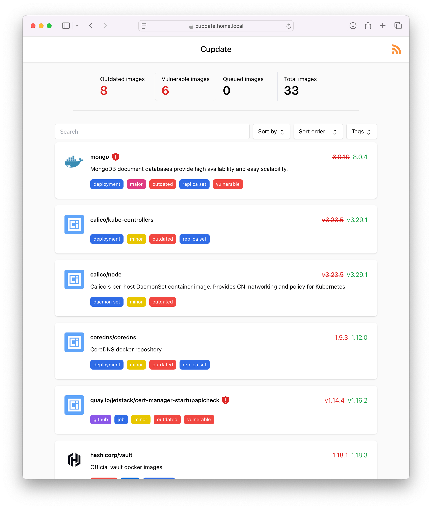
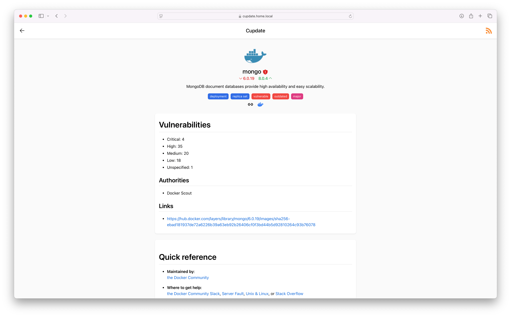
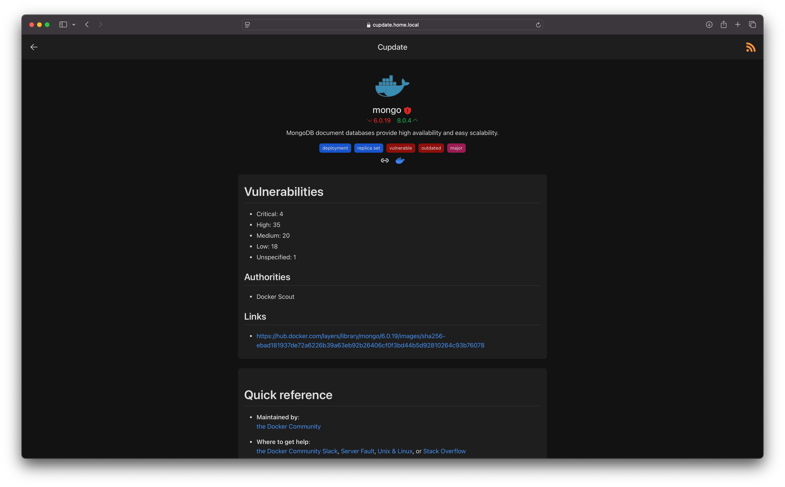

<p align="center">
  
</p>

# Cupdate

Cupdate is a WIP, zero-config service that helps you keep your container images
up-to-date. It automatically identifies container images in use in your
Kubernetes cluster or on your Docker host. Cupdate then identifies the latest
available version and makes this data and more available to you via a UI, API or
through an RSS feed.

Cupdate is for those who like the process of keeping their services up-to-date,
looking through what's outdated and what features new updates bring. Cupdate
will not help you deploy the updates. If you deploy your services using things
like [flux](https://github.com/fluxcd/flux2), then there are great services that
will modify your manifests for you, such as
[renovate](https://github.com/renovatebot/renovate). Cupdate is not about that,
nor will it ever be.

Features:

- Zero configuration required
- Auto-detect container images in Kubernetes and Docker (planned)
- Auto-detect the latest available container image versions
- UI for discovering updates
- Subscribe to updates via an RSS feed (planned)
- Graphs image versions' dependants explaining why they're in use
- Vulnerability scanning
- APIs for custom integrations

Supported registries:

- docker.io
- ghcr.io
- quay.io
- lscr.io
- registry.k8s.io, k8s.gcr.io

Supported data sources:

- Docker Hub, Docker Scout
- GitHub, GitHub Container Registry
- Quay

## Screenshots

| Light mode                                                                                            | Dark mode                                                                                           |
| ----------------------------------------------------------------------------------------------------- | --------------------------------------------------------------------------------------------------- |
|                          |                          |
|    |    |
|                        |                        |
|              |              |
|  |  |

## Architecture

See [docs/architecture/architecture.md](docs/architecture/architecture.md).

## Building

Either build using yarn+go, or docker.

```shell
yarn install
yarn build
go build -o cupdate cmd/cupdate/*.go
```

```shell
# Build for running the container
docker build -t ghcr.com/alexgustafsson/cupdate:latest .

# Build inside the container, for running on host
DOCKER_BUILDKIT=1 docker build --target=export . --output .
```

## Contributing

Cupdate is still being developed.

### Development

Proxy the API server.

```shell
kubectl proxy
```

Source the default dev config.

```shell
# Inspect
cat .env

# Bash etc.
source .env

# Fish
export (cat .env | xargs -L 1)
```

Start cupdate.

```shell
go run cmd/cupdate/*.go
```

Start the web server.

```shell
yarn run dev
```
