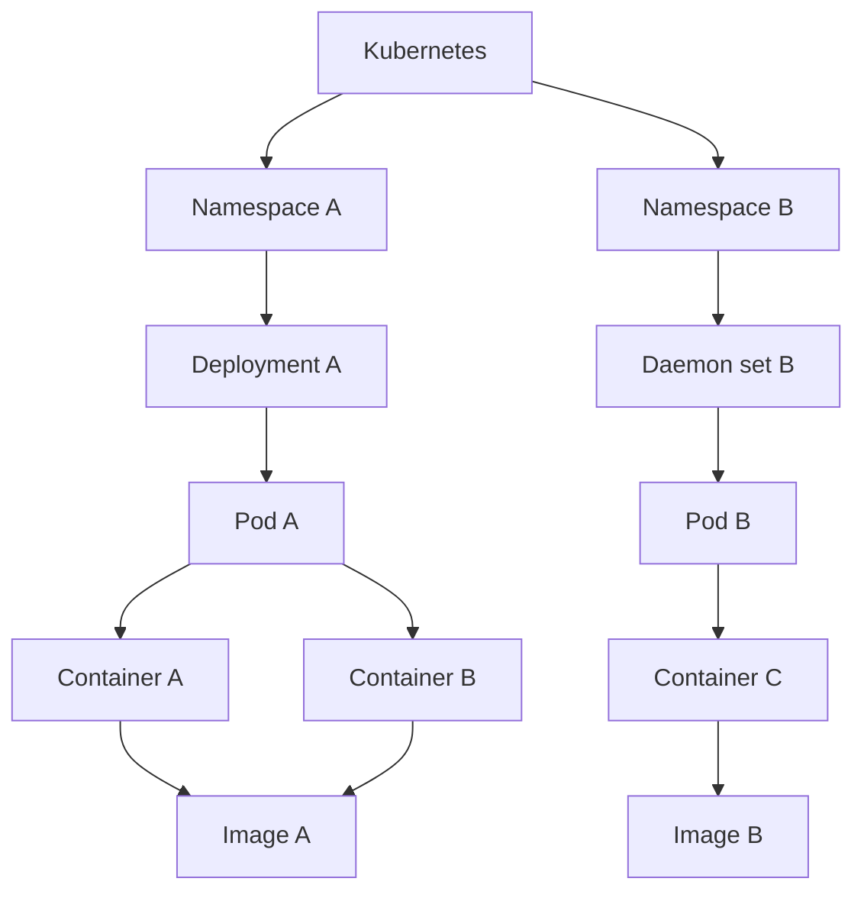
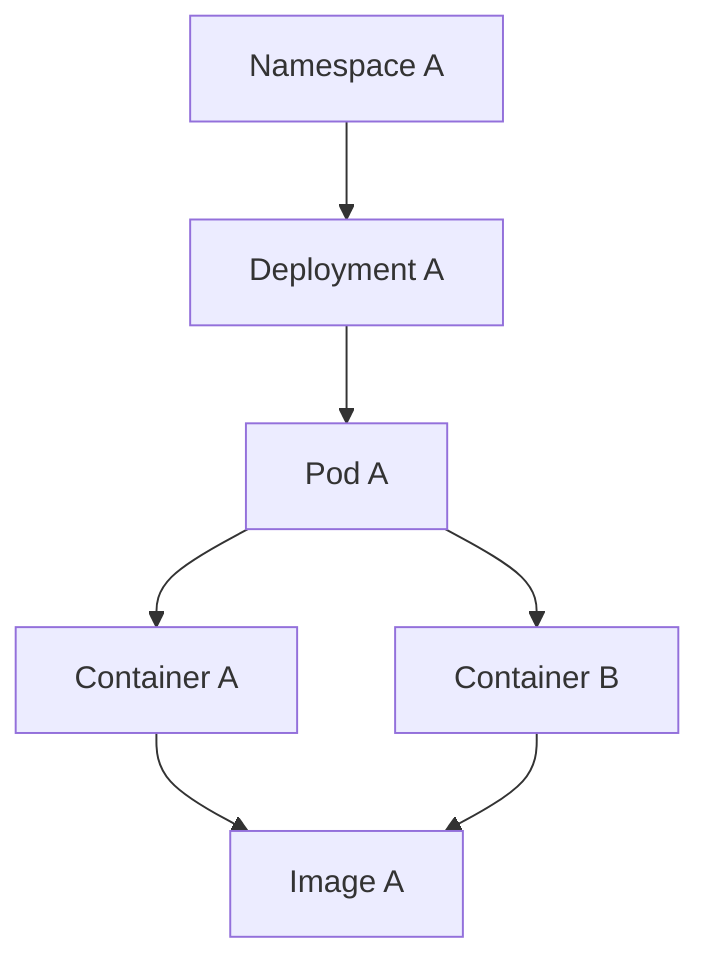
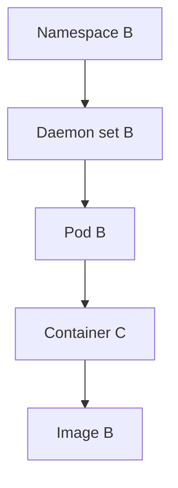
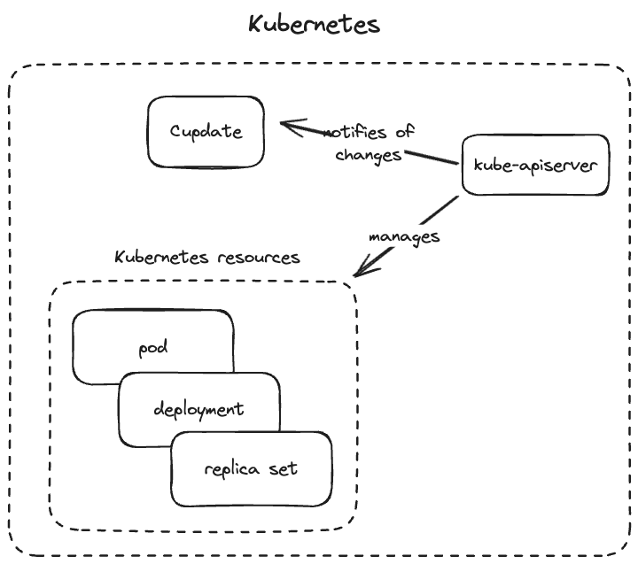

# Architecture

Cupdate discovers container images that are in use in a _platform_. Next,
Cupdate discovers new versions for these container images in their respective
OCI registry. Lastly data is enriched from sources like Docker Hub and GitHub,
depending on the information gathered about the image from the registry.

## Cupdate

## Platforms

Platforms are responsible for identifying all images in use, as well as how they
are used, by building a graph. Below is an example graph collected from
Kubernetes. In practice, the node for the platform itself is implicit and not
definied in code.

The graphs are generated and stored per image.

### Kubernetes

When running in Kubernetes, Cupdate lists and then watches all resources that
references an image. Resources such as pods directly refences an image that is
in use. Resources like deployments reference images through pod templates.

### Docker

When using Docker, Cupdate uses `docker.sock` directly to identify images and
containers using those images.

## Pipeline

Once images have been identified in platforms, a few steps are taken to
consolidate what images are available and how they're used. Henceforth an image
and a version (tag / digest) will be referred to as "image reference" or just
"reference".

- Deduplicate references and merge graphs

Once unique references have been identified, they are processed.

For each reference:

- Add registry tag
- Get the OCI manifests
  - Add links to code repositories
- Get the image's Docker Hub repository data
  - Set the image's description
  - Add link to Docker Hub
- Get the image's Docker Hub repository owner
  - Set the image's logo
- Identify the latest image version from Docker Hub
  - Set image's latest version
- Identify a GitHub release for the latest version
  - Set release notes

Next, the identified properties are deduplicated:

- Deduplicate tags
- Deduplicate links

Note that not all steps are always valid, such as fetching info about a GHCR
image from Docker Hub. Likewise, an image without references to GitHub won't
have information gathered from GitHub.
