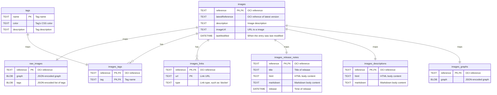

# Database

Cupdate uses sqlite to persist data.

<!--
| Meaning      | Left  | Right |
| ------------ | ----- | ----- |
| Zero or one  |   |o  |   o|  |
| Exactly      |   ||  |   ||  |
| Zero or more |   }o  |   o{  |
| One or more  |   }|  |   |{  |
 -->

