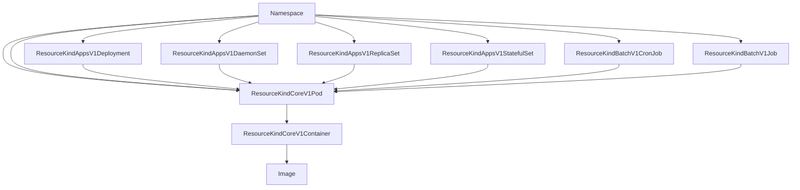

# Kubernetes

Cupdate is made to run well in Kubernetes. It is intended to be deployed as a
single node, optionally persisting its state to a persistent volume. Cupdate
will automatically react to changes to resources and update its data
accordingly.

Cupdate is intended to be run using a service account.

Please refer to [`rbac.yaml`](./rbac.yaml) and [`service.yaml`](./service.yaml)
for examples on how Cupdate can be configured to run in Kubernetes.

## Graph

The diagram below shows the graphing supported by the Kubernetes Cupdate
platform.

