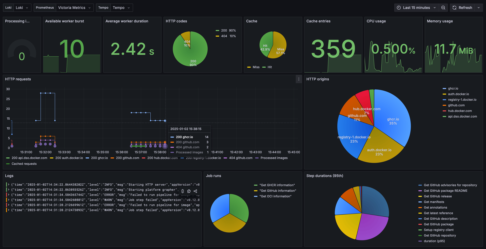

# Metrics

Cupdate exports open metrics on the `/metrics` path. The metrics can be used to
build Grafana dashboards like the one shown above.

The example dashboard is available in
[example-dashboard.json](example-dashboard.json).
