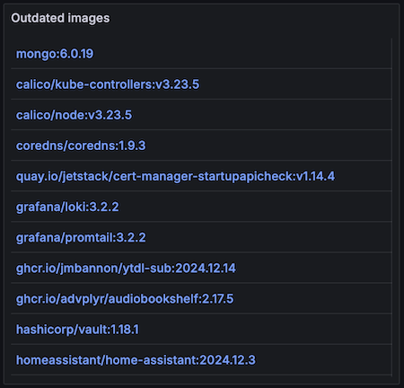

# Observability


Cupdate exports open metrics on the `/metrics` path. Cupdate also supports
pushing Open Telemetry traces. Cupdate uses structured JSON logs, making them
easy to correlate with traces and metrics. Lastly, Cupdate's API itself can be
used as a data source in Grafana, to list outdated images and more.

The observability data and API can be used to build Grafana dashboards like the
one shown above.

The example dashboard is available in
[example-grafana-dashboard.json](example-grafana-dashboard.json).

## Using Cupdate as a Grafana data source

### Configuring

First install the official Infinity plugin from
<https://github.com/grafana/grafana-infinity-datasource?tab=readme-ov-file#%EF%B8%8F-download>.

Next, configure a new data source. Name it "Cupdate". Under
"URL, Headers & Params", specify the URL to Cupdate. When using Kubernetes, you
can use the internally resolveable service name, such as
`http://cupdate.cupdate.svc.cluster.local:8080`. Under "Health check", configure
a custom health check and specify `/readyz` as the health check URL. Lastly,
under "Security", add the URL to cupdate once more and select "Allow". This will
ensure that dashboards can only use the Infinity data source to query Cupdate.

The configuration made above can also be provisioned from a YAML configuration.
See [cupdate-dashboard-data-source.yaml](cupdate-dashboard-data-source.yaml) for
an example.

## Querying

As an example of using Cupdate as a data source, we'll create a visualization
for the outdated images found by Cupdate, making it possible to click the rows
to open up Cupdate. For full API documentation, please refer to
[../../api.yaml](../../api.yaml).



Create a new visualization (or use the explore tool). Select Cupdate as the data
source and "UQL" as the type. Select "URL" as the source and "Table" as the
format. Specify "/api/v1/images" as the URL. If your Cupdate instance has a lot
of images, the default pagination will limit the number of results. To mitigiate
this, speciy a query parameter "size" and set it to a big number, such as 100.

Next, for the UQL query itself, input the following.

```uql
parse-json
| scope "images"
| jsonata "$['outdated' in tags]"
| project "reference"
```

Lastly, create a data link using the following URL template:

```text
https://cupdate.home.local/image?reference=${__data.fields["reference"]}
```

The panel's JSON can be found in
[example-grafana-visualization.json](example-grafana-visualization.json)
